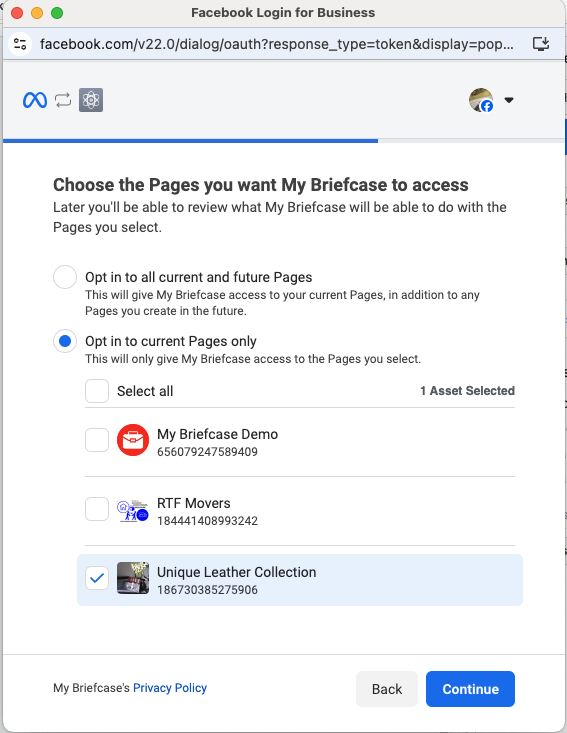
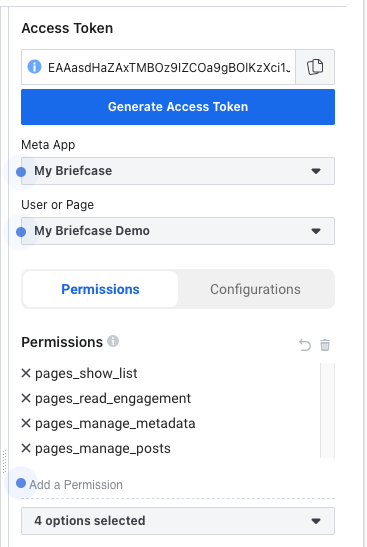

# run n8n local kit
- https://github.com/n8n-io/self-hosted-ai-starter-kit
- tutorial: https://www.youtube.com/watch?v=niEFfY6BCqs

# setup google project and stuff
- create project, enable APIs (Gmail)
- Setup OAuth consent
- Setup an App
- Add Test users
- https://console.cloud.google.com
- https://www.youtube.com/watch?v=iAokhB-bVBw

# setup facebook stuff
- Manual
    - steps which are a must
        - go to https://developers.facebook.com/
        - create an App (https://docs.n8n.io/integrations/builtin/credentials/facebookapp/)

    - got to Graph API Explorer tool (https://developers.facebook.com/tools/explorer/)
    - authenticate to a specific Page

    

    - select the app we just created above, in the 'Meta App' dropdown
    - select that page from the 'User or Page' dropdown
    - add some permissions 

    

    - copy the token
    - in n8n, create a credential `Facebook for Business Page` and save the token in it

- Automated
    - user connect their facebook via my integrations page
    - that gives me a User Token
    - my code then use the User Token to request a Page token

- https://developers.facebook.com/docs/facebook-login/guides/access-tokens

### read these and then delete
- https://medium.com/zero-to/empowering-ai-agents-automating-facebook-page-management-with-the-facebook-mcp-server-6a5c97f8ccb8
- https://www.agentx.so/post/setup-multi-agent-for-social-media-post-using-ai-agentic-workflows

# build a workflow/automation
- automation 1: just a PoC
    - read last 5 unread emails
    - create a summary and TODO list from them
    - post to Slack (personal) (maybe later, create a jira ticket or something)
        - lets say, create slack reminders
    - get the todos done as needed
    - post slack update for each
    - mark them done

- automation 2: 
    - Everyday at 6 PM
        - read emails
        - draft answers for them
        - present the drafts to me and ask for approval for individual replies
        - send the replies for the approved ones
        - re-draft the rejected ones and repeat till all is done

# use n8n agentic automation/worflows from the frontend
- vue or react app
- use the locally running n8n as the backend (http api requests)
- later, figure out how to host the n8n in the cloud or build my own using LangGraph etc